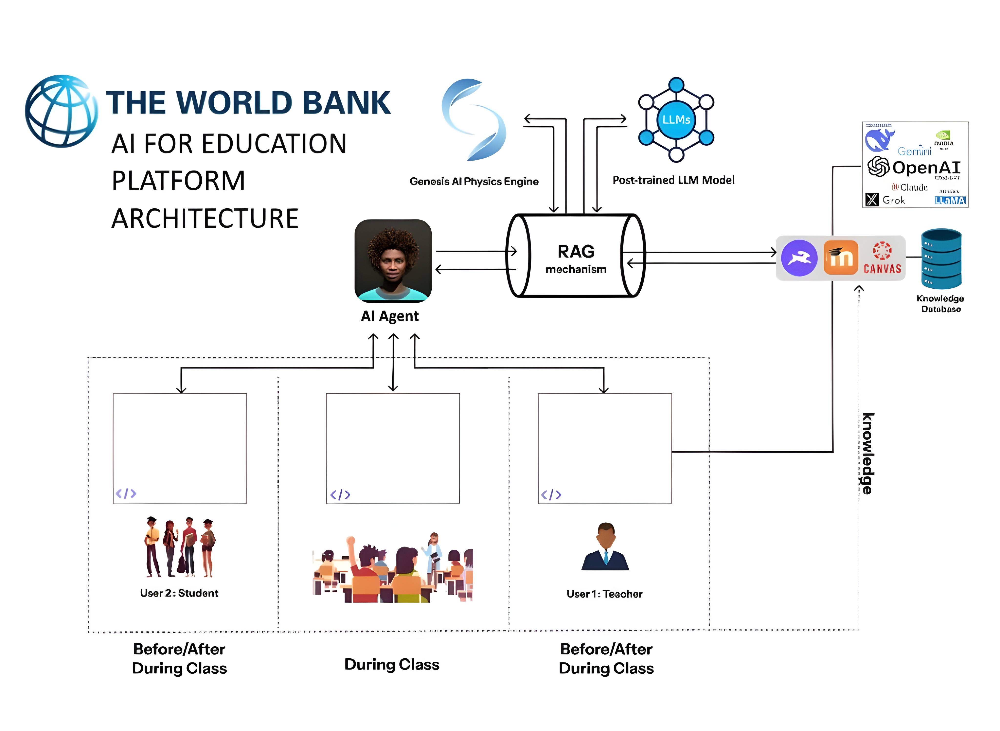
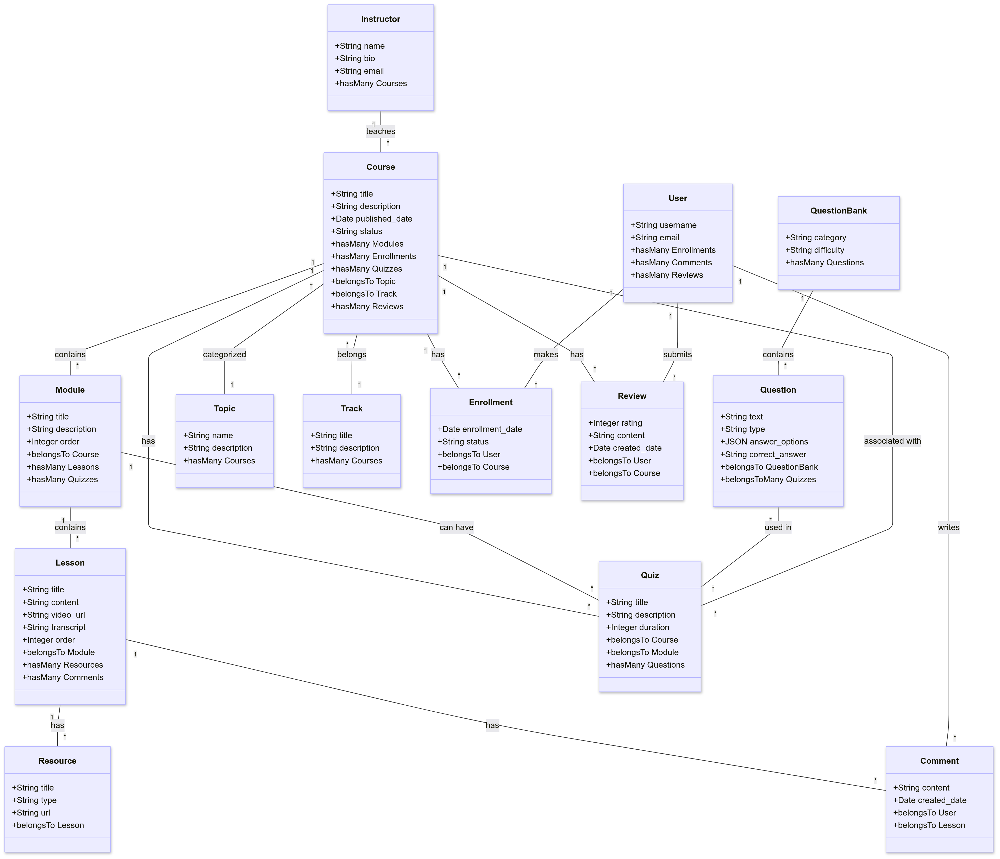
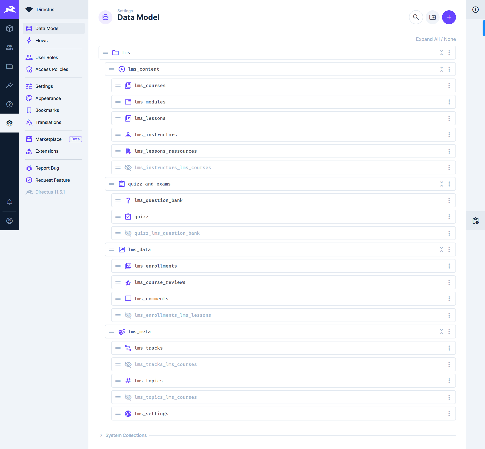

# TeckTal AI: Domain-Specific LLM with RAG and Knowledge Database



## Overview

Welcome to **TeckTal AI**, an open-source project designed to streamline the specialization of large language models (LLMs) using Retrieval-Augmented Generation (RAG) for short-term tasks and fine-tuning for long-term learning, all powered by a dynamic knowledge database.
Initially, this project targets the education domain, empowering educators to manage content in a flexible Learning Management System (LMS) environment integrated with cutting-edge AI capabilities. The architecture also supports an AI agent that serves as a virtual assistant for teachers and students.

## Components and General Architecture

### Knowledge Database with Directus

The first major component of our system is the knowledge database, powered by [Directus](https://directus.io/). Directus serves as a headless CMS that provides a user-friendly interface for managing and customizing your data models. In our project, it acts as the backbone for storing educational content and metadata, making the information easily accessible for retrieval and fine-tuning LLMs.

**Key Features:**

- **Customizable Data Models:** Create and modify collections and fields to suit your domain needs.
- **RESTful API Access:** Seamlessly interact with your data via Directus' robust API.
- **User-Friendly Data Studio:** Manage your content with a modern and intuitive web interface.

### LMS Architecture

Our Learning Management System (LMS) architecture is designed to be modular and extensible. It consists of several interconnected components, including courses, modules, lessons, instructors, quizzes, and more. The architecture diagram below illustrates how these components interact with one another and how they are mapped into the Directus CMS.



In Directus, each LMS component is implemented as a collection with fields defined to represent the data schema. For example, the `lms_course` collection contains fields such as `title`, `slug`, and `description`, and is linked to other collections like `lms_modules` and `lms_instructors`. This modular design allows us to easily extend the system to other domains over time.

## Getting Started

To get the project running locally, follow these steps to set up the knowledge database layer with Directus.

### Prerequisites

Before proceeding, ensure you have the following installed:

- **Docker & Docker Compose:** Most components run in Docker. Install both from [Docker's official site](https://www.docker.com/).
- **Python:** Supported versions include 3.7, 3.8, 3.9, and 3.10. Verify your installation by running:
  ```bash
  python --version
  ```

### Installation Steps

1. **Clone the Repository**

   ```bash
   git clone https://github.com/GalloV/TeckTal_AI.git

   cd TeckTal_AI
   ```

2. **Install python dependencies**
   ```bash
   pip install -r requirements.txt
   ```
3. **Launch the Directus Component**

   ```bash
   cd knowledge_database_layer/directus

   docker compose up -d
   ```

---

This command will launch the Directus instance on your local machine (typically accessible at http://localhost:8055). Log in with the admin credentials provided and start configuring your collections as described in the project documentation.

4. **Generate all lms database**

   ```bash
   cd knowledge_database_layer/python_scripts

   python create_data_model.py
   ```

   This script will create the entire structured LMS database including the collections, the fields, the relationships.
   The image below illustrates how these components are supposed to display.



## Integration of Directus with AnythingLLM

### What is AnythingLLM?

**AnythingLLM** is a powerful and user-friendly, all-in-one AI application that simplifies working with Large Language Models (LLMs) through no-code tooling. It supports **RAG** (Retrieval-Augmented Generation), **AI Agents**, and other advanced AI workflows — all with **zero infrastructure setup** required.

Created by **Mintplex Labs, Inc**, founded by **Timothy Carambat**, the project was part of **YCombinator’s Summer 2022** batch.

### Why use AnythingLLM?

it's a **zero-setup, private, all-in-one AI platform** that supports:

- RAG
- AI Agents
- Custom embeddings
- Multiple LLMs
- Vector database integration

it's **customizable for enterprise**, offering:

- Fine-grained permissioning
- Workspace-level data control
- Simple integration with existing databases

> Learn more on the [AnythingLLM Desktop](https://github.com/Mintplex-Labs/anything-llm) and Docker version GitHub repositories.

---

## Functional Integration with TeckTal AI

In this project, we integrated **AnythingLLM** with **Directus** to connect our educational knowledge base to a powerful AI chatbot system. Here's how the integration works and why it matters.

### Directus + AnythingLLM Workflow

as said earlier The data in our LMS — such as **courses, modules, and lessons** — is structured inside **Directus** as collections and fields. Instructors can manage this content using the Directus admin interface.

#### Exporting LMS Content to AnythingLLM

To bridge **Directus** and **AnythingLLM**, we developed custom scripts (included in this GitHub project) that automatically export course content from Directus into a **JSON format** that is compatible with AnythingLLM workspaces.

These JSON files are generated from the `lms_course`, `lms_module`, and `lms_lesson` collections and are enriched with metadata needed for the chatbot to understand educational context.


#### Step 3: Connecting to AnythingLLM Workspace

Once the JSON files are created, they are programmatically added to a specific **AnythingLLM workspace**. This allows the chatbot to be trained on real course content and become capable of answering student or teacher questions in context.


---

### Why This Matters

- **Full AI-Driven User Experience:**  
  The chatbot can answer real questions based on live course data — lesson plans, module overviews, key topics, etc.

- **Enhanced Teacher Support:**  
  Instructors can ask questions like _“What topics are covered in Module 2 of the Machine Learning course?”_ and get instant answers.

- **Foundation for Caytu AI Agent Integration:**  
  In the future, the same chatbot interface can serve as a **bridge between Directus and Caytu’s AI agent**, making the assistant even more capable of interacting with users naturally.

- **No More Knowledge Gaps:**  
  The knowledge database becomes **fully explorable, searchable, and conversationally accessible**.


